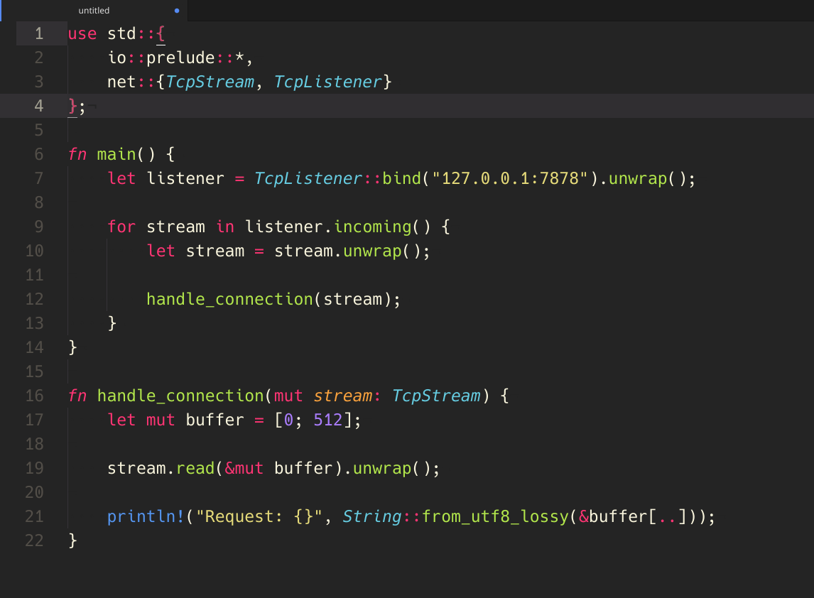

# monokai-grayjack-syntax theme

[](https://github.com/skylerlee/monokai-grayjack-syntax/releases)
[](https://github.com/skylerlee/monokai-grayjack-syntax/releases)
[](./LICENSE)

A brighter monokai theme variant for Atom.



> The font used in the screenshot is [Hack Nerd Complete](https://github.com/ryanoasis/nerd-fonts).

# Features
Some highlight optimization for many languages.

### Installation

```
apm install monokai-grayjack-syntax
```

Alternatively, open **Settings** > **Install**, select **Themes** and search for `monokai-grayjack-syntax`.

### License
The MIT License.
